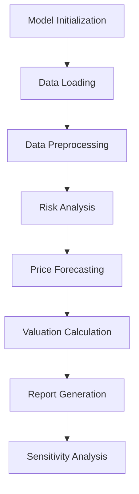

# Code Execution Flow

## 🔄 **Overall Architecture**



## 📋 **Detailed Execution Flow**

### **Step 1: Model Initialization** 🚀

```python
model = RenewableAssetValuation('HackathonDataset.xlsx')
```

**What happens:**
- Defines 3 markets: ERCOT, MISO, CAISO
- Sets asset types: ERCOT(Wind), MISO(Wind), CAISO(Solar)
- Initializes risk appetite: P75 (75% probability)
- Sets forecast years: 2026-2030
- Defines peak hours for each market

### **Step 2: Data Loading** 📊

```python
load_data()
```

**Processing flow:**
1. Read Excel file with 3 worksheets
2. Skip first 7 rows of headers/notes
3. Parse and standardize column names
4. Convert date formats
5. Split historical data and forward curves
6. Clean data (remove invalid values)

**Output:**
- `self.data[market]`: Historical hourly data
- `self.forward_curves[market]`: Forward price curves

### **Step 3: Risk Analysis Module** ⚠️

#### **3.1 Basis Risk Analysis**
```python
analyze_basis_risk(market)
```

**Calculations:**
- RT Basis = RT_Busbar - RT_Hub
- DA Basis = DA_Busbar - DA_Hub
- Statistics: mean, std deviation, percentiles
- Negative basis frequency
- Correlation analysis

#### **3.2 Negative Price Analysis**
```python
analyze_negative_prices(market)
```

**Assessments:**
- Negative price frequency
- Average negative price level
- Generation during negative prices
- Revenue impact amount
- Curtailment scenario (stop generation when price < $0)

#### **3.3 Generation Analysis**
```python
calculate_generation_profile(market)
```

**Analysis dimensions:**
- Monthly capacity factors
- Peak/off-peak generation patterns
- Seasonal factors
- Hourly generation curves

### **Step 4: Price Forecasting** 📈

```python
forecast_prices(market)
```

**Monte Carlo Simulation Flow:**

1. **Calculate Historical Volatility**
   - RT price annualized volatility
   - DA price annualized volatility

2. **Generate 1,000 Scenarios**
   ```
   For each simulation:
      ├── Generate monthly price shocks (normal distribution)
      ├── Apply to forward curve base prices
      ├── RT price = base price × (1 + RT shock)
      ├── DA price = base price × (1 + DA shock × 0.7)
      └── Add basis to get Busbar prices
   ```

3. **Output Price Scenario Matrix**
   - 5 years × 4 products × 1,000 scenarios

### **Step 5: Risk-Adjusted Pricing** 💰

```python
calculate_risk_adjusted_price(market)
```

**Core Calculation Steps:**

1. **Merchant Scenario Revenue Simulation**
   ```python
   For each scenario:
      Total Revenue = Σ(Annual Generation × Annual Price / Discount Factor)
   ```

2. **P75 Threshold Determination**
   - Sort 1,000 merchant revenue scenarios
   - Take 25th percentile as P75 revenue

3. **Fixed Price Back-calculation**
   ```python
   Base Fixed Price = P75 Revenue / (Annual Avg Generation × 5-year PV Factor)
   ```

4. **Product Differentiation**
   - RT_Hub = Base price
   - RT_Busbar = Base price + RT basis mean
   - DA_Hub = Base price × 0.95 (lower risk discount)
   - DA_Busbar = DA_Hub + DA basis mean

### **Step 6: Risk Adjustment Calculation** 🎯

```python
calculate_risk_adjustments(market)
```

**Five Risk Factors:**

| Risk Type | Calculation Method | Adjustment Range |
|-----------|-------------------|------------------|
| Volume Risk | Coefficient of Variation × 0.1 | 0-5% |
| Negative Price Risk | Negative frequency × 0.5 | 0-10% |
| Basis Risk | Basis volatility / 100 | 0-3% |
| Technology Risk | Solar 2%, Wind 3% | 2-3% |
| Liquidity Risk | Market-specific | 1-3% |

**Final Price Adjustment:**
```python
Final Price = Base Price × (1 - Total Risk Adjustment)
```

### **Step 7: Monthly Generation Forecast** 📅

```python
generate_monthly_generation_forecast(market)
```

**Forecast Process:**
1. Extract historical monthly patterns
2. Calculate peak/off-peak hours
3. Apply capacity factors
4. Generate 2026-2030 monthly forecast

### **Step 8: Market Attractiveness Scoring** 🏆

```python
evaluate_market_attractiveness()
```

**Scoring System:**
```python
Volatility Score = max(0, 100 - Merchant Volatility/1000)
Negative Price Score = max(0, 100 - Negative Frequency × 500)
Basis Score = max(0, 100 - Basis Volatility)

Combined Score = (Volatility + Negative + Basis) / 3
```

**Decision Recommendations:**
- Score > 70: Strong fixed-price hedge candidate
- Score 50-70: Consider partial hedge (50-75%)
- Score < 50: Consider staying merchant

### **Step 9: Report Generation** 📝

```python
run_full_analysis()
```

**Output Contents:**
1. Risk-adjusted prices for each market
2. Risk breakdown details
3. Negative price impact analysis
4. Monthly generation forecast samples
5. Market comparison and recommendations

### **Step 10: Sensitivity Analysis** 🔍

```python
# Test different P-levels
for p_level in [0.50, 0.75, 0.90]:
    model.risk_level = p_level
    results = model.calculate_risk_adjusted_price(market)
```

**Analysis Dimensions:**
- P50: Aggressive strategy (50% probability)
- P75: Baseline strategy (75% probability)
- P90: Conservative strategy (90% probability)

## 🔗 **Data Flow Diagram**

```
Historical Data ──┐
                  ├──> Risk Analysis ──┐
Forward Curves ───┘                    ├──> Price Simulation ──> Revenue Scenarios ──> P75 Pricing
                                      │
                                      └──> Risk Adjustments ──> Final Prices
```

## 🎯 **Key Decision Points**

1. **Data Quality Check**: Ensure sufficient historical data
2. **Risk Parameter Calibration**: Adjust based on market characteristics
3. **P-level Selection**: Based on company risk appetite
4. **Hedge Ratio**: Determined by market score

## 📊 **Processing Flow Example**

```
Input: 3 years historical + 5 years forward curves
  ↓
Process: 26,304 records/market
  ↓
Simulate: 1,000 price scenarios
  ↓
Calculate: 4 product prices
  ↓
Output: Risk-adjusted fixed prices + Hedging recommendations
```

## 🔑 **Key Process Features**

### **Data Pipeline**
```python
Raw Data → Validation → Cleaning → Transformation → Analysis
```

### **Risk Pipeline**
```python
Historical Patterns → Statistical Analysis → Risk Quantification → Price Adjustment
```

### **Valuation Pipeline**
```python
Price Scenarios → Revenue Simulation → P75 Calculation → Fixed Price Derivation
```

## 💡 **Process Optimization Points**

1. **Parallel Processing**: Monte Carlo scenarios can be parallelized
2. **Caching**: Store calculated statistics for reuse
3. **Incremental Updates**: Support adding new data without full recalculation
4. **Memory Management**: Process large datasets in chunks

## 🎨 **Customization Hooks**

The flow allows customization at multiple points:

```python
# Before risk analysis
model.custom_preprocessing()

# Custom risk factors
model.add_risk_factor('regulatory_risk', 0.02)

# Alternative pricing methods
model.pricing_method = 'CVaR'  # Instead of VaR

# Custom output formats
model.output_format = 'detailed'  # or 'summary'
```

## 📈 **Performance Metrics**

Typical execution times:
- Data Loading: ~2 seconds
- Risk Analysis: ~5 seconds/market
- Price Simulation: ~10 seconds/market
- Total Analysis: ~1 minute for all markets

## 🔄 **Error Handling Flow**

```python
try:
    Load Data
except DataError:
    Log error → Use default values → Continue
    
try:
    Calculate Prices
except CalculationError:
    Fallback to simplified method → Warn user
```

This flow design ensures:
- **Transparency**: Every risk factor is quantified
- **Reproducibility**: Standardized calculation process
- **Flexibility**: Supports parameter adjustments
- **Practicality**: Direct output for business decisions
- **Robustness**: Handles edge cases and data issues